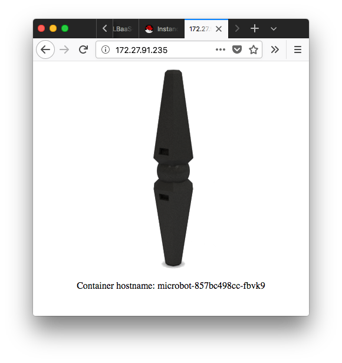

### Setting up LBaaS v2 and Cinder on a Kubernetes cluster on Openstack

##### Prerequisites : 

1. A kubernetes cluster with calico networking, and neutron ports forwarded. With the kubelet runnning with a cloud config that looks something like : 

		[Global]
		auth-url="http://172.27.66.32:5000/v2.0"
		username="tb15"
		password="***"
		region="regionOne"
		tenant-id="54f4b77fa87f4daea196f43f4a48a7af"

		[BlockStorage]
		bs-version=v2

		[LoadBalancer]
		subnet-id=7a870e20-d4db-48a4-b12a-4b581e1fa6cb
		floating-network-id=9f50f282-2a4c-47da-88f8-c77b6655c7db
		create-monitor=yes
		monitor-delay=1m
		monitor-timeout=30s
		monitor-max-retries=3

2. See [kubespray setup guide](kubespray.md) for how to do this.

3. Kubectl set up on your workstation.

It's also worth reading about [storage classes](https://kubernetes.io/docs/concepts/storage/storage-classes/), [persistent volumes](https://kubernetes.io/docs/concepts/storage/persistent-volumes/) and [persistent volume claims](https://kubernetes.io/docs/concepts/storage/persistent-volumes/#persistentvolumeclaims) 


###### Setting Cinder as the Default storage class 

(The adding of the cinder storage class can now be done by setting `persistent_volumes_enabled: true` in `inventory/group_vars/k8s-cluster.yml` (Kubespray) )

1. Add the [Cinder 'gold' storage class](cinder_storage_class.yaml) to your cluster
	* `kubectl create -f cinder_storage_class.yaml`

```yaml
kind: StorageClass
apiVersion: storage.k8s.io/v1
metadata:
  name: gold
provisioner: kubernetes.io/cinder
parameters:
  availability: nova
```

2. Run `kubectl get storageclass` to ensure it has been added correctly
3. Now run `kubectl patch storageclass gold -p '{"metadata": {"annotations":{"storageclass.kubernetes.io/is-default-class":"true"}}}'` 
4. Run `kubectl get storageclass` again, `gold (default)` should be returned. 

It is worth noting that the kubernetes docs on storage classes add a parameter `type` (e.g ` - type : fast `) It is worth checking that your openstack's CinderV2 API supports / has types enabled (httpie and [here](https://developer.openstack.org/api-ref/block-storage/v2/#list-all-volume-types-for-v2))* If it does not have them enabled, when you try to provision a PV kubernetes will return the helpful, cryptic error `Resource not found`

*Openstack often move things, leaving broken links. [The Wayback Machine](https://archive.org/web/) is great for this

##### Provisioning a Cinder volume 


Run `kubectl create -f pv.json` 

The result of `kubectl get pv` should now show 

```
NAME                                       CAPACITY   ACCESS MODES   RECLAIM POLICY STATUS      CLAIM                     STORAGECLASS   REASON    AGE
glusterfs                                  29Gi       RWX            Retain           Available                                                      3d
pvc-60a9ba38-e64e-11e7-803e-fa163edc9f09   10Gi       RWO            Delete           Bound       development/cinderterst   gold                     1h

```
[pv.json](pv.json)

```json
 {
  "kind": "PersistentVolumeClaim",
  "apiVersion": "v1",
  "metadata": {
    "name": "claim1",
    "annotations": {
        "volume.beta.kubernetes.io/storage-class": "gold"
    }
  },
  "spec": {
    "accessModes": [
      "ReadWriteOnce"
    ],
    "resources": {
      "requests": {
        "storage": "10Gi"
      }
    }
  }
}
```

##### LBaaS V2 

> A cut down version of [henriquetruta's openstack_cloud_provider tutorial](https://github.com/henriquetruta/kubernetes-tutorials/tree/master/openstack_cloud_provider)

If the cloud configuration was correct, kubernetes should be able to automatically provision a load balancer for use. We will test this by deploying the microbot service behind a loadbalancer.

**If you get an error something along the lines of 'Resource not found' make sure you've put the correct networks and subnets into the cloud_config file**

You may want to do this in a new namespace so it is easy to tear down. 

`kubectl create -f microbot/microbot_deploy.yaml` 

This will create a deployment of 3 microbot pods, managed by a replicaset. 

Verify this by running `kubectl get deployment microbot`

```
NAME       DESIRED   CURRENT   UP-TO-DATE   AVAILABLE   AGE
microbot   3         3         3            3           1d
```

Now we can create the a public service deployed behind a load balancer 

`kubectl create -f microbot/microbot_svc.yaml`

Note the annotations :

```yaml
annotations:
    service.beta.kubernetes.io/openstack-internal-load-balancer: "false"
```

and type: 
```yaml
type: LoadBalancer
```
Now running `kubectl describe svc microbot | grep Ingress` 

```
LoadBalancer Ingress:     10.0.0.18, 172.27.91.235
```

Now pointing your browser towards http://172.27.91.235/ should return a result like this:




Refreshing the page should return a different hostname. 

You can now set up an ingress controller such as nginx or traefik. 

*Note*: Load Balancers are not deleted automatically when the service is removed, they must be removed manually. 
        [this script](delete_lb.sh) partially automates that process.
